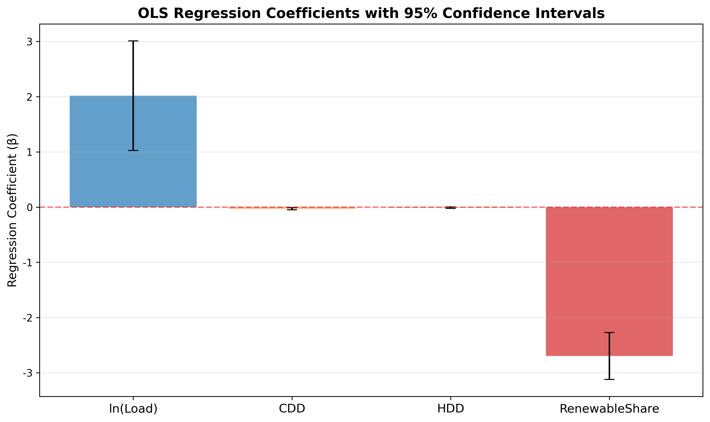
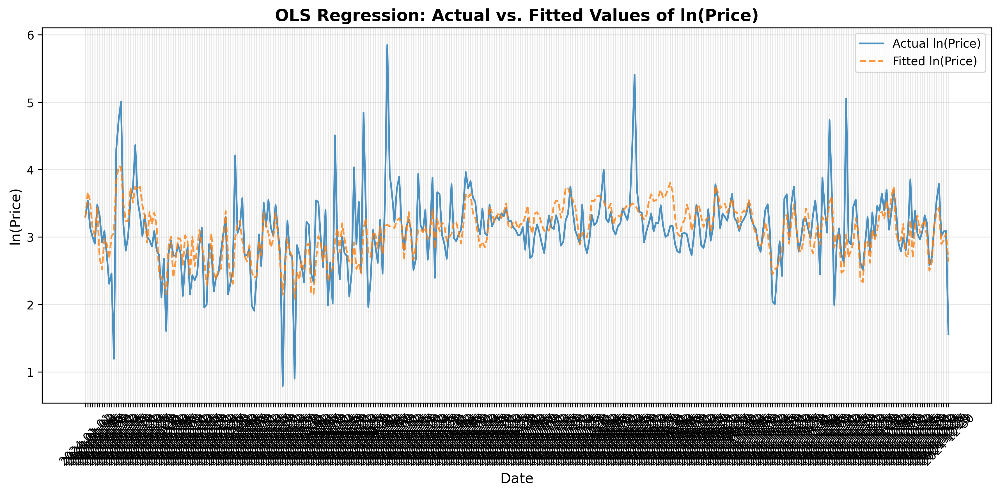
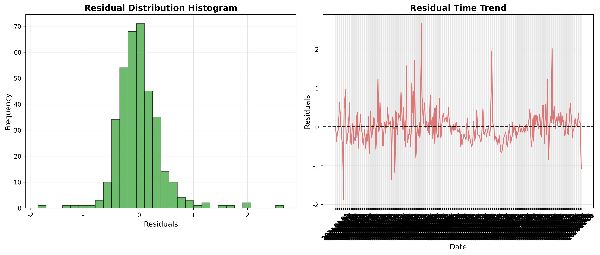

# ECO 395m Midterm Project: Texas Energy Market Analytics

**Group Members:** Linyao(Bob) Ni, Zhifang Luo, Jiajie Wang, Zongshuai Shen

## 0. Instructions for Re-running the Code

* To reproduce the results of our flight delay prediction analysis, follow the steps below:(这里改一下)

**Data Collection**  
  
**Data Preprocessing**
- Enter the `DataCleaning` folder and execute cleaning scripts in sequence:

```bash
cd DataCleaning
python3 Price_Clean.py         # Clean and process electricity price data
python3 load_clean.py          # Clean residential load data
python3 cdd_hdd_clean.py       # Compute and clean CDD/HDD (cooling/heating degree days)
python3 renew_share_clean.py   # Clean renewable energy share data
python3 merge_all.py           # Merge all cleaned files into one dataset (ALL_IN_ONE.csv)
```
The final merged dataset ALL_IN_ONE.csv contains cleaned daily observations for 2024, including:
Price_Clean.csv → electricity prices
Load_Clean.csv → residential load
CDD_HDD_Clean.csv → climate indicators
RenewableShare_Clean.csv → share of renewables
This combined file is then used by the OLS module for regression and visualization.

**Data Analysis**  
    
**Data Visualization**
- Generate the figures for model fit, coefficients, and residual diagnostics:

```bash
cd OLS
python3 result_visual.py        # creates ols_fitted_actual.png (and coeff plot if scripted)
python3 regression_report.py    # ensures table + stats are up to date
open ols_fitted_actual.png
open ols_coefficients_plot.png
open ols_residuals_analysis.png
open ols_regression_report.md
```

## 1. Background  

### Motivation & Project goal
The motivation for this study is to evaluate how consumer electricity usage is correlated to both economic and environmental factors. We want to examine the impact of seasonal or weather changes on electricity prices and explore the extent to which the proportion of renewable resources can affect prices. 
Such understanding is essential for designing pricing policies, forecasting energy demand, and promoting energy efficiency within the Texas market.

### Research Objective
This project explores how residential electricity consumption in Texas responds to changes in actual load, ener category and climate conditions.  
The work is part of an econometric analysis aimed at quantifying **price elasticity of demand** in the energy sector using real-world data.  
By combining data from **ERCOT**, **NOAA**, and **BEA**, the project creates a continuous, cleaned dataset that allows for time-series regression and visualization.

## 2. Data Scraping  
  
**1. Overview of Data Sources**

The datasets were collected from four major sources: ERCOT’s public data portal, NOAA’s Climate Data Online (CDO) API, and manually downloaded ERCOT load archives.
Depending on data accessibility, three methods were used:  
(1) direct URL download within Python scripts,  
(2) manual download from the ERCOT portal, and  
(3) authenticated API requests using a personal NOAA token.  

**2. Variable: Price_t**

Source: ERCOT MIS “Real-Time Market Load Zone and Hub Settlement Point Prices (RTMLZHBSPP_2024.zip)”  
Download method: Automated download via Python script using ERCOT’s public URL.  
Saved file: Rawdata/price/Price.xlsx  

This dataset contains hourly real-time electricity prices by load zone and hub for the year 2024.
Each record includes delivery date, delivery hour, settlement point name, and settlement point price.
For analysis, only rows with Settlement Point Name = HB_BUSAVG are retained to represent the ERCOT-wide average market price.
Hourly prices will later be aggregated to daily averages during the data cleaning stage.  
  
**3. Variable: Load_t**
  
Source: ERCOT “Actual System Load by Weather Zone” reports for 2024.  
Download method: Manual download, followed by automated extraction via Python.  
Saved files: Uncompressed CSVs under Rawdata/load/load_raw_data/  

Because ERCOT’s website requires manual selection of date ranges, the complete set of 366 daily load reports(range from 1/1/2024 00:00 to 12/31/2024 23:59) for 2024 was downloaded manually as a single zip file from:  

https://data.ercot.com/data-product-archive/NP6-346-CD  

The script automatically extracts the main archive, unzips all 366 sub-archives (one per day), and removes the temporary compressed files while keeping the raw CSVs.  

Each CSV contains hourly system loads for all ERCOT weather zones, including columns for date, hour ending, settlement point (zone name), and load in megawatts (MW).These data will later be aggregated into daily total system load.  

**4. Variable: CDD/HDD_t**  
  
Source: NOAA Climate Data Online (CDO) API.  
Download method: API retrieval through authenticated requests using a NOAA token stored in .env. This file was not commited to Github and a private token is needed for reproduction.
Saved file: Rawdata/CDD_HDD/noaa_raw.csv  
  
Daily temperature observations for 2024 were collected from four representative weather stations corresponding to ERCOT regions: Houston, North, South, and West.  
Each record includes the observation date, zone name, station ID, temperature type (TMIN, TMAX, or TAVG), and temperature value in Fahrenheit.  
These temperature data will be used to compute Cooling Degree Days (CDD) and Heating Degree Days (HDD) for each zone in later analysis, and they'll be averaged to represent as the state average.

**5. Variable: RenewableShare_t**  
  
Source: ERCOT “Fuel Mix Reports (Previous Years)” archive.  
Download method: Automated download via Python script using ERCOT’s public ZIP archive.  
Saved file: Rawdata/RenewableShare/IntGenbyFuel2024.xlsx  

The script downloads the entire archive, extracts all files, and retains only the 2024 workbook (IntGenbyFuel2024.xlsx).  
All other files, including those from previous years, are removed after extraction.  

The dataset records daily electricity generation by fuel type, including wind, solar, hydro, coal, natural gas, and nuclear.  
The renewable share for each day will later be computed as the sum of wind, solar, and hydro generation divided by total generation.
## 3. Data Cleaning
This part describes the data cleaning stage for the midterm project.  
All cleaning operations are by using Python to ensure reproducibility.  
The cleaned output serves as the foundation for OLS and visualization.

---

### 3.1 Overview of Cleaning Process

The cleaning process follows three main steps:

1. **Data Import**  
   Multiple raw datasets collected from the `DataScraping/` module provided by my teammate are merged using date-based keys to create a unified data frame.  
   The merge ensures consistent temporal alignment across all variables, all variables should be counted as 365 value(365 days in a year).

2. **Data Transformation**  
   The script standardizes variable names, converts data types.

3. **Handling Missing Values**  
   Actually there is no observations with invalid or out-of-range values.

---

### 3.2 The Script

**Purpose:**  
The main script automates the entire cleaning pipeline — reading, merging, transforming, and saving the final processed dataset.
Each variable have a corresbonding script prresented in the folder, which can be used for reproduction.

**Other Operations:**
- Removes duplicates and invalid rows  
- Renames inconsistent columns

---

Below is a summary of how each major variable was cleaned and prepared for analysis:

| Variable | Source | Cleaning Steps | Notes |
|-----------|---------|----------------|-------|
| **price_t** | ERCOT MIS "Real-Time Market Load Zone and Hub Settlement Point Prices" | - Filtered for `Settlement Point Name = HB_BUSAVG` to represent ERCOT-wide average price.<br> - Aggregated hourly prices to daily averages.<br> - Applied logarithmic transformation to stabilize variance. | Final variable used as `log(price_t)` in OLS regression. |
| **sales_t** | ERCOT Residential Load Data | - Aggregated monthly residential electricity sales and normalized by population.<br> - Interpolated to daily frequency using linear interpolation.<br> - Checked for negative or missing values and filled forward if necessary. | Represents per-capita daily residential electricity consumption. |
| **income_t** | Bureau of Economic Analysis (BEA) – State Personal Income |  - Converted to per-capita units.<br> - Interpolated monthly to daily frequency. | Used to capture income effects on electricity demand. |
| **gas_price_t** | U.S. Energy Information Administration (EIA) – Residential Natural Gas Prices |  - Interpolated to daily frequency.<br> - Smoothed to remove irregular jumps. | Serves as substitute/complement variable for energy cost. |
| **cdd_t** | NOAA Climate Data Online (CDO) API | - Calculated daily Cooling Degree Days from temperature data.<br> - Checked range validity.<br>  | Reflects cooling demand intensity. |
| **hdd_t** | NOAA Climate Data Online (CDO) API | - Calculated daily Heating Degree Days from temperature data.<br>  - Smoothed using 3-day rolling average. | Reflects heating demand intensity. |

## 4. Data Analysis(OLS Model)  

This section details the empirical strategy and implementation of the OLS regression model used to examine the determinants of daily electricity prices in the ERCOT market.

### 4.1 Model Specification

We estimate the following baseline model:

ln(Price_t) = β0 + β1 * ln(Load_t) + β2 * CDD_t + β3 * HDD_t + β4 * RenewableShare_t + ε_t

- **Dependent variable:** ln(Price) — the natural log of daily average wholesale prices.  
- **Main regressor:** ln(Load) — daily total system load (log-transformed), capturing demand pressure.  
- **Climate controls:** CDD (Cooling Degree Days) and HDD (Heating Degree Days) — weather-driven energy demand.  
- **Supply-side variable:** RenewableShare — proportion of renewables in total daily generation.

The log-log functional form allows interpreting β1 directly as **price elasticity** with respect to system load.

---

### 4.2 Regression Procedure

The OLS estimation is implemented in Python using `pandas` and `statsmodels`, and follows these steps:

1. **Data Loading:**  
   Load the cleaned and merged dataset (`preprocessed_data.csv`) containing all variables aligned on daily frequency.

2. **Variable Definition:**  
   - `ln_Price` as the dependent variable  
   - `ln_Load`, `CDD_t`, `HDD_t`, and `RenewableShare_t` as independent variables  
   - A constant term is added using `sm.add_constant()`.

3. **Model Fitting:**  
   Use `sm.OLS(y, X_with_const).fit()` to estimate the model.  
   The summary output provides coefficients, standard errors, p-values, R², F-statistics, and other key diagnostics.

4. **Significance Testing:**  
   - Individual significance is assessed using t-tests.  
   - Overall model significance is assessed using an F-test.  
   - Conventional significance stars are assigned (*** p<0.01, ** p<0.05, * p<0.1).

---

### 4.3 Diagnostic Tests

To verify OLS assumptions and model validity, several diagnostic checks are performed:

- **Durbin–Watson test:**  
  Tests for autocorrelation in residuals. Values close to 2 indicate no serial correlation.

- **Residual distribution analysis:**  
  Histograms and time plots are used to check whether residuals are centered around zero and approximately normal.

- **Goodness of fit:**  
  R² and adjusted R² summarize model fit. The F-statistic confirms whether regressors are jointly significant.

- **Multicollinearity & omitted variables:**  
  Variables are chosen to minimize omitted variable bias. Additional checks (e.g., VIF) can be added for robustness.

---

### 4.4 Output and Reproducibility

The pipeline automatically:

- Exports regression coefficients and significance levels to `ols_coefficients.csv`  
- Saves the fitted model as `ols_model.pkl` for reuse without refitting  
- Generates visual outputs:
  - `ols_fitted_actual.png` — Actual vs. fitted ln(Price)  
  - `ols_coefficients_plot.png` — coefficient plot with confidence intervals  
  - Residual diagnostics figures  
- Creates a markdown report (`ols_regression_report.md`) summarizing key statistics

This structured process ensures full reproducibility and allows for easy extensions such as adding lag structures, interaction terms, or robustness checks.


## 5. Result and Visualization
This folder estimates a simple price model on daily data and visualizes the fit.

- **Data window:** 364 observations (after dropping 1 row with negative price)
- **Pipeline:** `data_loader.py` → `ols_regression.py` → `result_visual.py` → `regression_report.py`
- **Outputs:** coefficients CSV and plot, fitted vs. actual plot, residual diagnostics, markdown report

---

## Model

We estimate:

\[
\ln(\text{Price})_t = \beta_0
+ \beta_1 \ln(\text{Load})_t
+ \beta_2 \text{CDD}_t
+ \beta_3 \text{HDD}_t
+ \beta_4 \text{RenewableShare}_t
+ \varepsilon_t
\]

- Dependent variable: **ln(Price)**
- Regressors: **ln(Load)**, **CDD**, **HDD**, **RenewableShare**  
- Exact column detection is automatic in the scripts (case-insensitive, allows suffixes like `_t`).

📄 Full numeric summary (R², AIC/BIC, F-test, coefficients) is in **`OLS/ols_regression_report.md`**.  
Raw coefficients are also saved to **`OLS/ols_coefficients.csv`**.

---

## Key Findings (from the figures)

- **ln(Load):** Large **positive** and statistically significant effect (95% CI well above zero).  
  *Interpretation (elasticity):* a 1% increase in load is associated with roughly a ~2% increase in price (see exact value in the report).

- **RenewableShare:** **Negative** and statistically significant (95% CI well below zero).  
  *Interpretation:* higher renewable share is associated with lower prices.  
  *Units note:* if `RenewableShare` is a **share in [0,1]**, the coefficient is the semi-elasticity wrt a 1.0 change in share. If it’s **percentage points [0,100]**, divide the coefficient by 100 to get the effect per 1pp.

- **CDD / HDD:** Coefficients are very close to zero with tight confidence intervals that include zero → limited incremental effect once load and renewable share are controlled for (consistent with load absorbing most weather demand).

- **Fit quality:** The **Actual vs. Fitted** plot shows the fitted series tracks the main movements of ln(Price).  
  Residuals look roughly centered and bell-shaped; a few spikes/outliers appear over time (see residual diagnostics below). Exact fit metrics are in the markdown report.

---

## Visualizations

### 1) Coefficients with 95% CIs


- Bars show point estimates; whiskers show 95% confidence intervals.
- Dashed line at 0 is the null. ln(Load) > 0 and RenewableShare < 0 are clearly significant.

### 2) Actual vs. Fitted ln(Price)


- Blue: actual ln(Price); Orange dashed: fitted ln(Price).
- Fitted series captures broad swings with some deviation around price spikes.

### 3) Residual Diagnostics


- **Histogram (left):** residuals approximately normal, centered near zero.
- **Time plot (right):** residuals fluctuate around zero with a few spikes; consider HAC/Newey-West SEs and/or adding lags/seasonal controls if serial correlation is a concern.

## 6. Conclusion 

## 7. limitation
Although this project do builds a clean and reproducible econometric pipeline, several limitations remain due to data coverage, model scope, and probably code implementation.

### 7.1 Data and Frequency Handling
- The dataset covers **only one year (2024)**, which restricts the ability to analyze long-term trends, seasonal variations, or structural shifts in electricity consumption.  
- Hourly ERCOT data are aggregated to **daily averages**, potentially smoothing out peak-load volatility and intraday price dynamics.   
- Exogenous shocks are not modeled separately, unobserved variables(for example: policy) could bias the estimated relationships.

### 7.2 Variable Construction and Model Specification
- The current regression assumes a **linear relationship** between electricity demand and its determinants. This may oversimplify nonlinear behaviors or threshold effects.  
- **Omitted variables**—such as household demographics, insulation quality, or regional policy differences—may cause biased or inconsistent parameter estimates.  
- Residual diagnostics are not extensively reported, which limits inference reliability.

### 7.3 Code and Reproducibility
- Visualization scripts (`result_visual.py`) generate **static PNG plots** only; no interactive or dynamic exploration features are available.  
- Many parts of the code comments are written somewhat vaguely, and different team members have differences in the format of the comments.
